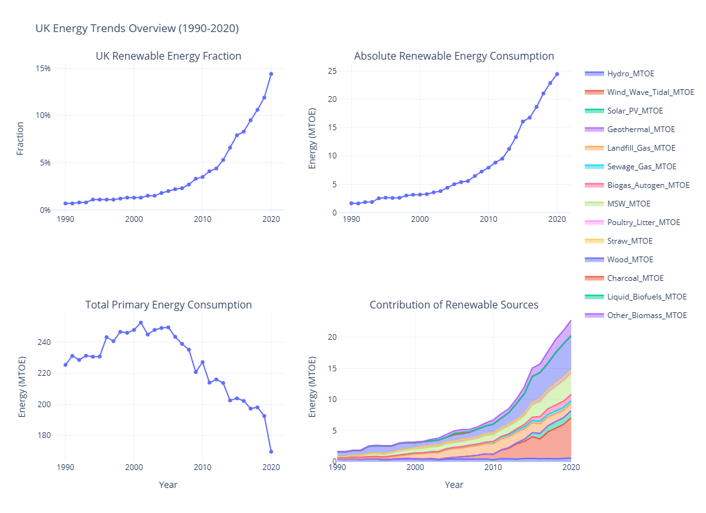

# UK Renewable Energy Trends Analysis (1990-2020) 🇬🇧⚡️

## Overview

This repository contains a data analysis project exploring the evolution of renewable energy consumption within the United Kingdom from 1990 to 2020. As the UK progresses towards its Net Zero 2050 target, understanding historical energy transition patterns is crucial. This project analyzes key trends, identifies primary growth drivers within the renewable sector, and visualizes the changing energy landscape over three decades.

This project serves as a portfolio piece demonstrating skills in data analysis, visualization, and insight generation using Python.

## Key Visualisation: UK Energy Trends Dashboard (1990-2020)

The dashboard below summarizes the key trends analyzed in this project.

 

* **Source:** Data compiled from UK government energy statistics, accessed via Kaggle.
* **Timeframe:** 1990 - 2020 (Annual data).
* **Key Variables:**
    * Total primary energy consumption (MTOE).
    * Total energy from renewable & waste sources (MTOE).
    * Fraction of total energy from renewable & waste sources (%).
    * Detailed breakdown by renewable source type (Hydro, Wind/Wave/Tidal, Solar PV, Geothermal, Landfill Gas, Sewage Gas, MSW, Biomass types, Biofuels, etc.).

## Methodology & Tools

The analysis was conducted using Python within a Jupyter Notebook / Google Colab environment. Key steps included:

1.  **Data Loading & Cleaning:** Importing the dataset using Pandas, cleaning column names, and verifying data types.
2.  **Exploratory Data Analysis (EDA):** Examining overall trends in total consumption and renewable energy growth (absolute and fractional).
3.  **Source Contribution Analysis:** Investigating the changing mix of renewable sources over time using data reshaping (`melt`) and stacked area visualizations.
4.  **Visualization:** Creating interactive plots using Plotly Express and Plotly Graph Objects to present findings clearly.
5.  **Dashboard Creation:** Combining key visuals into a single dashboard using Plotly Subplots.

* **Main Libraries:** `pandas`, `plotly`

## Key Findings & Insights

Analysis of the 1990-2020 data revealed several key insights:

* **Accelerated Renewable Growth:** A significant acceleration in both the absolute amount (MTOE) and the fraction (%) of renewable energy occurred, primarily after 2005-2010.
* **Wind Power Dominance:** Wind energy (Wind/Wave/Tidal category) emerged as the single largest driver of renewable generation growth during this period.
* **Significant Biomass/Waste Role:** Various forms of biomass and energy-from-waste consistently contributed a substantial share of the renewable mix and also grew in absolute terms.
* **Rise of Solar PV:** Solar PV deployment saw rapid growth, especially from 2010 onwards, becoming a notable contributor by 2020.
* **Declining Total Demand:** Overall UK primary energy consumption peaked in the mid-2000s and trended downwards towards 2020, amplifying the impact of renewable growth on the national energy fraction.
* **Early Stagnation:** The first decade (1990s) showed very slow progress compared to the rapid changes observed later.

## Observations & Potential Recommendations (Based on 1990-2020 Data)

The historical trends observed suggest:

* Policies supporting **wind and solar deployment** were effective in driving capacity growth up to 2020.
* The substantial reliance on **biomass/waste** necessitates careful consideration of feedstock sustainability and lifecycle emissions (not available in this dataset).
* Continued focus on **energy efficiency** is crucial, as reducing overall demand significantly aids the transition to a higher renewable energy fraction.
* The rapid increase in variable sources implies a growing need for **grid flexibility and storage** solutions.

*Disclaimer: These are observations based on historical data analysis (ending 2020) within this project and do not constitute definitive policy advice for the current date.*

## Limitations & Future Work

* **Data Recency:** The primary limitation is that the dataset ends in 2020. Analysis of data from 2021 onwards is critical to understand the latest trends and impacts of recent global events and policies.
* **Data Granularity:** More detailed data would allow for deeper insights, specifically:
    * Sustainability metrics and origins for biomass/waste feedstocks.
    * Breakdown of wind (onshore vs. offshore).
    * Regional energy consumption and generation data.
    * Grid performance and curtailment data.
    * Direct carbon emissions data linked to energy sources.
    * Economic data (investment, costs) and specific policy timelines for correlation analysis.

**Future analysis could focus on incorporating more recent data and exploring the correlation between policy interventions and renewable energy deployment.**

## Running the Analysis

1.  Clone the repository: `git clone https://github.com/FutureAI22/UK-Renewable-Energy-Consumption-1990-2020.git`
2.  Navigate to the directory: `cd UK-Renewable-Energy-Consumption-1990-2020`
3.  Ensure you have Python and the required libraries (`pandas`, `plotly`, `kaleido` for image export) installed. You might want to use a virtual environment.
    * Consider adding a `requirements.txt` file.
4.  Open the notebook (e.g., `notebooks/UK_Energy_Analysis.ipynb` - **ACTION: Adjust name/path if needed**) using Jupyter Lab/Notebook or Google Colab.
5.  Run the cells sequentially to perform the analysis and generate visuals.

---

*Developed as a data analysis portfolio project. Find me on [LinkedIn](https://www.linkedin.com/in/yourprofile)* ```
